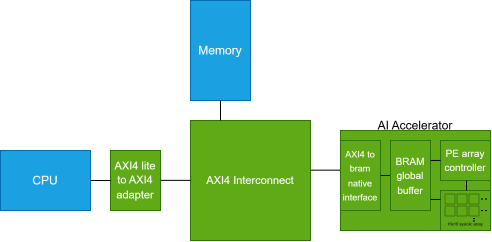

#### AI accelerator 

Architecture:

Tested using weights from MNIST digit recognition model extracted from python model. 
1 layer with 784 inputs and 16 outputs used.
Compared result to golden model in python.

Software based uses multiplication instructions. Hardware based loads the weights and activations into the ai accelerator buffer and starts it.

Weights are streamed into the processing elements (PE) 16x16 array. Streaming takes 256(16x16) cycles + 3 cycles per read (BRAM latency).

Software based output: 0 0 0 0 0 0 0 34 7 5 2 1 0 3 0 0  

Software based time taken: 2,472,926 cycles  

Accelerator based output: 0 0 0 0 0 0 0 34 7 5 2 1 0 3 0 0   

Accelerator based time taken: 1,497,878 cycles  

Registers: ctrl=0x30000000, status=0x30000004 (bit0=done), weights=0x30000008, activations=0x30004000, results=0x30000080.  

Global buffer and registers are 32 bit wide. Activations and weights are 8 bit quantized.

Possible improvements:
1. Double weights buffer. Allows streaming of the next set of weights during current computation.
2. Addition of more than one accelerator and parallelizing computation.