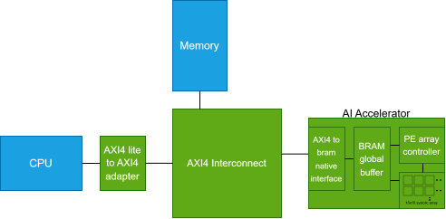

# AI accelerator 

Architecture:

Tested using weights from MNIST digit recognition model extracted from python model. 
1 layer with 784 inputs and 16 outputs used.
Compared result to golden model in python.

Software based uses multiplication instructions. Hardware based loads the weights and activations into the ai accelerator's global buffer and starts it.

Weights are streamed into the processing elements (PE) 16x16 array. Streaming takes 256(16x16) cycles + 3 cycles per read (BRAM latency).

Software based output: 0 0 0 0 0 0 0 34 7 5 2 1 0 3 0 0  

Software based time taken: 2,472,926 cycles  

## Accelerator based - no DMA
Output: 0 0 0 0 0 0 0 34 7 5 2 1 0 3 0 0   

Time taken: 1,497,878 cycles  

## Accelerator based - with DMA

Output: 0 0 0 0 0 0 0 34 7 5 2 1 0 3 0 0   

Time taken: 51018 cycles  

Accelerator Registers: ctrl=0x30000000, status=0x30000004 (bit0=done), weights=0x30000008, activations=0x30004000, results=0x30003E00.  

DMA registers:
Source address = 0x40000018
Destination address = 0x40000020
Read length address = 0x40000028

Global buffer and accelerator registers are 32 bit wide. Activations and weights are 8 bit quantized.

### Implementation details

Clock = 100 MHz 
Latency = cycles/clk = 51018/100000 = 0.51018 s = 510.18 ms
Total on-chip power = 0.38 W
Energy per Inference = 0.1938684 J = 193.8684 mJ

LUTs = 26100 (Accelerator = 22658, Picorv32 core = 2091)
Registers = 14085 (Accelerator = 11432, Picorv32 core = 1242)
F7 Muxes = 66
F8 muxes = 32
Block RAM tiles = 8.5 (Accelerator = 7.5, Flash memory = 1)

## Possible improvements:
1. Double weights buffer. Allows streaming of the next set of weights during current computation.
2. Addition of more than one accelerator and parallelizing computation.